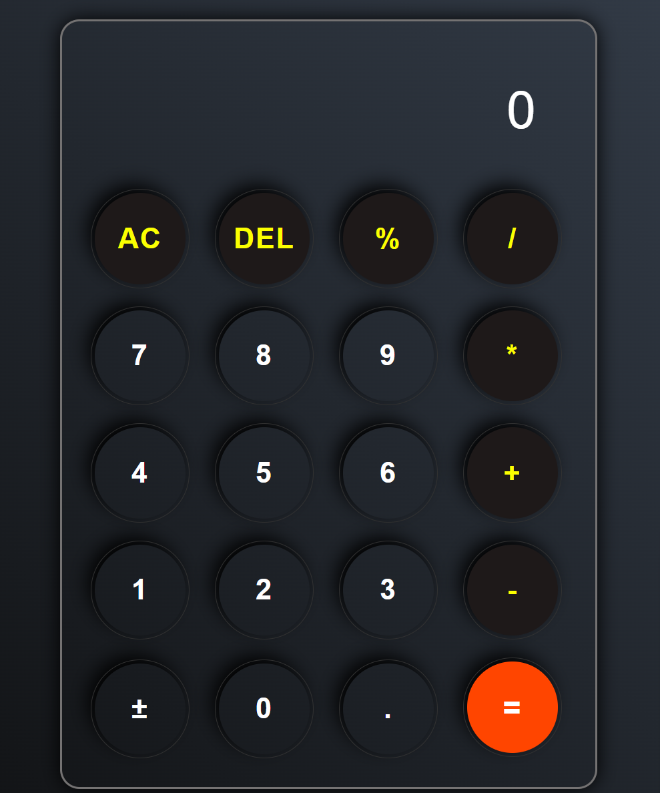

# Calculator

A simple and interactive calculator built using HTML, CSS, and JavaScript. This project provides basic arithmetic functionalities like addition, subtraction, multiplication, and division, all packaged in a clean and minimalistic UI.

## Demo

[Link to Live Demo](https://sanskargupta0.github.io/Calculator/) *(Replace this with your live link if available)*

 *(Replace with a screenshot of your calculator)*

## Features

- **Basic Arithmetic Operations**: Perform addition, subtraction, multiplication, and division.
- **Responsive Design**: Works well on both desktop and mobile devices.
- **Keyboard Support**: Allows input through the keyboard for a better user experience.

## Project Structure

calculator ├── index.html # Main HTML file ├── style.css # Styling for the calculator UI ├── script.js # JavaScript for calculator functionality └── README.md # Project documentation


## Getting Started

To run this project locally, follow these steps:

1. **Clone the repository**:
    ```bash
    git clone https://github.com/Sanskargupta0/Calculator.git
    ```
2. **Navigate to the project directory**:
    ```bash
    cd calculator
    ```
3. **Open `index.html` in a web browser**:
    - Double-click `index.html` or open it through a browser to see the calculator in action.

## Usage

1. **Click or tap** on the buttons to perform calculations.
2. **Use the keyboard** for quicker inputs:
   - Numbers (0-9), operators (+, -, *, /), and Enter for equals.
   - Use Backspace to delete the last digit.

## Customization

Feel free to modify the CSS file (`style.css`) to change the colors, layout, or button styles. You can also enhance the functionality by adding more features in `script.js`, such as square roots, percentages, or memory functions.

## Contributing

If you’d like to contribute:

1. Fork the repository.
2. Create a new branch: `git checkout -b feature-name`.
3. Make your changes and commit them.
4. Push to the branch: `git push origin feature-name`.
5. Submit a pull request.

## License

This project is licensed under the MIT License - see the [LICENSE](LICENSE) file for details.
